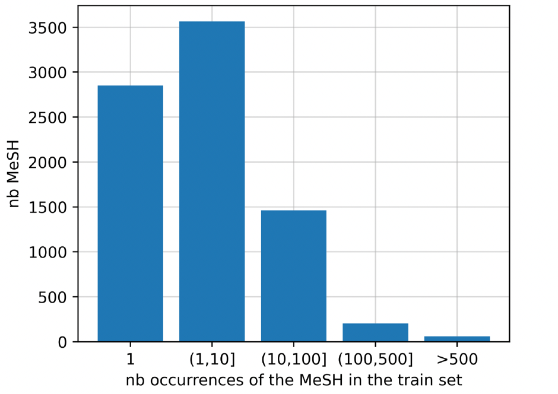
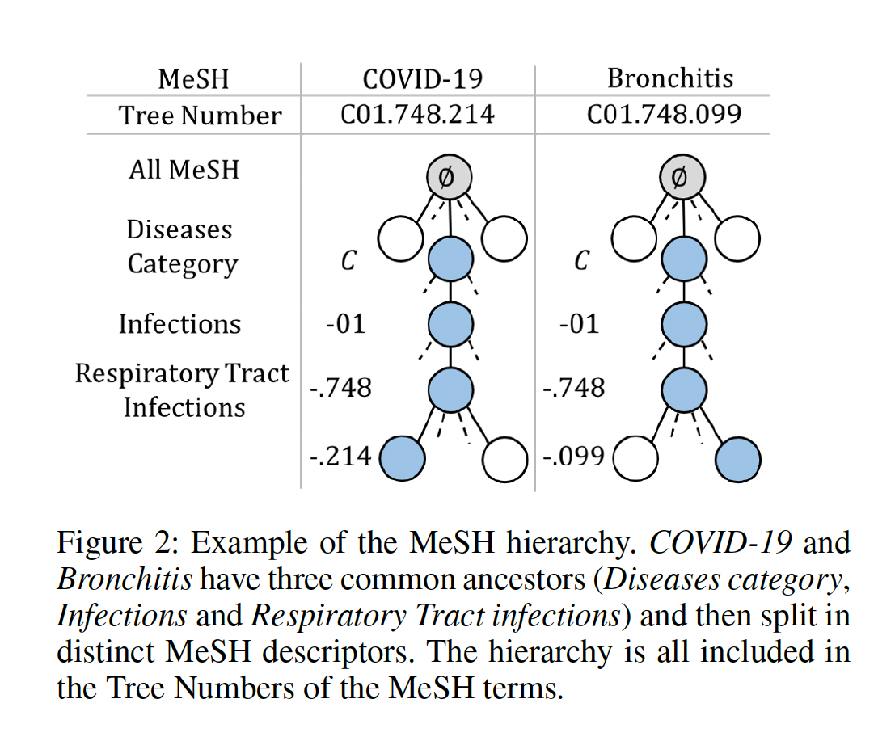
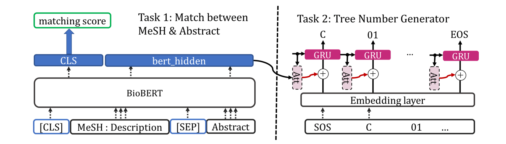
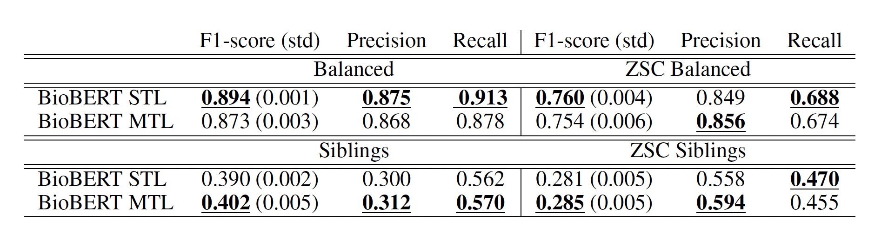

# Zero-Shot and Few-Shot Classification of Biomedical Articles: A Comprehensive Analysis

## Introduction
The rapid expansion of biomedical research has resulted in an overwhelming number of scientific publications. Efficiently classifying and indexing these publications is crucial for researchers to find relevant studies quickly. Traditionally, articles are manually annotated with Medical Subject Headings (MeSH), a structured thesaurus used for biomedical literature indexing. However, manual annotation is time-consuming and inefficient, especially during crises like the COVID-19 pandemic, when new terms emerge frequently.

To address this challenge, **Zero-Shot Learning (ZSL) and Few-Shot Learning (FSL)** techniques are being explored to automate biomedical article classification without requiring large labeled datasets. This study investigates how **BioBERT**, a biomedical adaptation of BERT, facilitates zero-shot classification by leveraging the hierarchical and semantic structures inherent in MeSH terms.

## Understanding the Role of MeSH in Biomedical Classification
### What is MeSH?
MeSH (Medical Subject Headings) is a controlled vocabulary developed by the National Library of Medicine (NLM) for systematically indexing biomedical literature. The hierarchical structure of MeSH enables researchers to find related topics efficiently.

### Why is MeSH Important?

- Provides structured categorization of biomedical research.
  
- Facilitates efficient search and retrieval of relevant literature.
  
- Enables systematic reviews and meta-analyses.

During the COVID-19 pandemic, new biomedical concepts emerged rapidly, necessitating fast and accurate classification of research articles. Traditional methods struggled to keep up, highlighting the importance of automated classification models.

## Zero-Shot Learning (ZSL) and Few-Shot Learning (FSL) in Biomedical Text Classification

### What is Zero-Shot Learning?

ZSL is a classification approach where the model correctly assigns labels it has never seen before. It achieves this by leveraging semantic relationships between known and unknown classes. This is particularly useful in biomedical research, where new diseases, treatments, and conditions emerge frequently.

### How Does BioBERT Enhance ZSL?

BioBERT is a pre-trained transformer model specialized for biomedical text. It incorporates domain-specific knowledge to improve classification accuracy. This study explores two main approaches:

1. **Single-Task Learning (STL):** BioBERT encodes abstracts and MeSH descriptions together.
  
2. **Multi-Task Learning (MTL):** Integrates the MeSH hierarchy, enhancing classification accuracy by incorporating additional context.

## Mathematical Formulation:

To train a robust classifier, we define a **multi-task loss function** that optimizes both binary classification and hierarchical prediction:

$$ 
\mathcal{L}_{tot} = \frac{1}{2\sigma_1^2} \mathcal{L}_1 + \frac{1}{2\sigma_2^2} \mathcal{L}_2 + \log(\sigma_1 \sigma_2)
$$

where:

L1 is the binary cross-entropy loss for classification.

L2 is the negative log-likelihood loss for hierarchical prediction.

Sigma1 and Sigma2 are learnable parameters that balance the losses.

## Hierarchical Probing: Understanding the Model’s Knowledge

To assess whether BioBERT effectively learns the MeSH hierarchy, two **probing tasks** were used:

1. **Shortest-Path Probe:** Measures whether the model encodes distances between MeSH terms accurately.

2. **Common-Ancestors Probe:** Evaluates whether the model understands shared hierarchical ancestry between terms.

These probing tasks help determine how well the model captures biomedical relationships beyond simple keyword matching.

## Experimental Setup and Evaluation

### Datasets Used

1. **Medline/MeSH:** A large dataset with extensive MeSH annotations.

2. **LitCovid:** A specialized subset focused on COVID-19-related publications.

### Evaluation Metrics

- **Zero-Shot Testing:** Evaluates the model’s ability to generalize to unseen labels.

- **Few-Shot Testing:** Tests performance with limited labeled examples.

- **Hierarchical Probing:** Analyzes how well the model captures structured relationships in the dataset.

### Performance Comparison

- **STL Model:** Shows strong generalization for broader MeSH categories.

- **MTL Model:** Performs better in distinguishing fine-grained, closely related terms by leveraging hierarchical relationships.

## Related Work

Several studies have investigated zero-shot and few-shot classification in biomedical literature. Notable works include:

- **Wang et al. (2019)** explored zero-shot learning with pre-trained language models.

- **Chalkidis et al. (2020)** proposed attention mechanisms for text classification.

- **Rios and Kavuluru (2018)** incorporated hierarchical knowledge into biomedical classification.

- **Hewitt and Manning (2019)** introduced structural probing techniques for evaluating model representations.

## Challenges and Suggested Improvements
### Challenges Faced

1. **Handling Rare Categories:** Certain MeSH terms appear infrequently, making it difficult for the model to generalize.

2. **Computational Complexity:** Training on all possible label-document pairs is computationally expensive.

3. **Data Annotation Inconsistencies:** Different datasets may use slightly different labeling schemes, affecting classification performance.

### Suggested Improvements

1. **Balanced Training:** More sophisticated sampling methods could improve the model’s ability to handle rare categories.

2. **Hierarchical Sampling:** Training with closely related negative examples can enhance term differentiation.

3. **Retrieval-Augmented Classification:** Integrating models like BM25 or ColBERT to first narrow down candidate labels before classification.

## Future Work

- **Improving the Multi-Task Learning Framework:** Refining the hierarchical loss function to improve precision in zero-shot classification.

- **Incorporating External Knowledge Graphs:** Using biomedical ontologies to improve contextual understanding.

- **Scalability Optimization:** Implementing retrieval-augmented techniques for handling large-scale classification problems efficiently.

## Conclusion
This study highlights the power of Zero-Shot Learning for biomedical article classification. By leveraging hierarchical relationships and sophisticated NLP models like BioBERT, researchers can improve classification accuracy and scalability. Future research should focus on enhancing hierarchical sampling techniques and integrating retrieval-based methods to optimize performance further.

## References
1. Lupart, S., Favre, B., Nikoulina, V., & Ait-Mokhtar, S. (2022). **Zero-Shot and Few-Shot Classification of Biomedical Articles in Context of the COVID-19 Pandemic**. arXiv:2201.03017.
2. Wang, W., Zheng, V. W., Yu, H., & Miao, C. (2019). **A survey of zero-shot learning: Settings, methods, and applications**. ACM Transactions on Intelligent Systems and Technology (TIST).
3. Chalkidis, I., et al. (2020). **An Empirical Study on Large-Scale Multi-Label Text Classification Including Few and Zero-Shot Labels**. arXiv:2010.01653.
4. Rios, A., & Kavuluru, R. (2018). **Few-Shot and Zero-Shot Multi-Label Learning for Structured Label Spaces**. EMNLP.
5. Hewitt, J., & Manning, C. D. (2019). **A Structural Probe for Finding Syntax in Word Representations**. NAACL.

