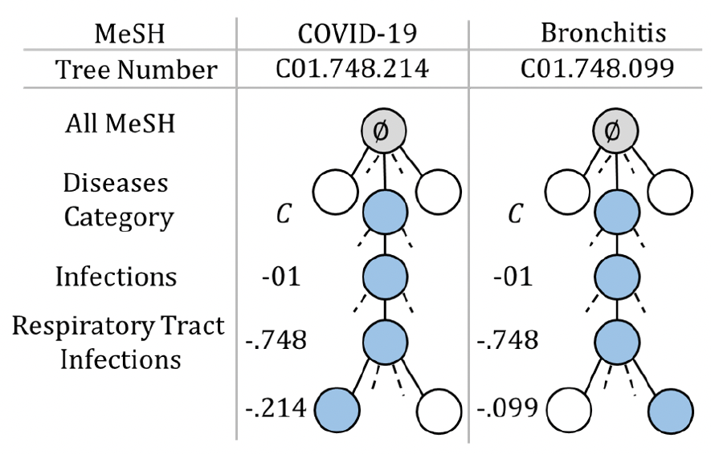

# Zero-Shot and Few-Shot Classification of Biomedical Articles in the Context of the COVID-19 Pandemic

## Introduction

The COVID-19 pandemic has triggered a global health crisis, resulting in an unprecedented surge of biomedical literature. With the rapid evolution of the virus and the constant emergence of new findings, it has become imperative to efficiently categorize and index this vast pool of scientific knowledge. Traditional methods for indexing biomedical literature, such as the manual assignment of **Medical Subject Headings (MeSH)** to articles, require significant human effort and are highly resource-intensive. As the volume of biomedical publications continues to increase, these manual annotation processes become increasingly unsustainable. 

To address this challenge, modern **machine learning (ML)** techniques such as **zero-shot learning (ZSL)** and **few-shot learning (FSL)** have emerged as powerful alternatives. These techniques enable the classification of biomedical articles into predefined categories with minimal to no labeled data. By leveraging advanced Natural Language Processing (NLP) models like **BioBERT**, which are pre-trained on large-scale biomedical corpora, these approaches promise to automate the process of classifying vast amounts of research literature efficiently and accurately.

In this report, we explore the potential of combining **BioBERT**, a domain-specific NLP model, with MeSH's hierarchical structure to enhance the performance of zero-shot and few-shot classification tasks. Our objective is to develop a robust framework that leverages these techniques to facilitate scalable biomedical article categorization and indexing, particularly in response to the COVID-19 pandemic.

## Background

### Medical Subject Headings (MeSH)

**Medical Subject Headings (MeSH)** is a comprehensive and controlled vocabulary developed by the **National Library of Medicine (NLM)** for indexing biomedical and health-related articles in databases like **PubMed**. MeSH organizes concepts into a hierarchical structure, with each concept assigned a unique identifier. The hierarchy facilitates precise categorization of articles based on the subject matter, and each MeSH term is linked to a definition and a tree number that indicates its position in the hierarchy. The hierarchical nature of MeSH allows for multi-level categorization and indexing, ensuring that articles are classified under broader, related topics and more specific subtopics.

This organization of biomedical knowledge into a tree structure provides not only a way to classify research articles but also serves as a valuable source of semantic information. Researchers can leverage MeSH to improve the accuracy and specificity of article retrieval and classification. The comprehensive nature of MeSH makes it an invaluable resource, especially in rapidly changing fields like **COVID-19** research, where new terms and concepts emerge regularly.

### Zero-Shot and Few-Shot Learning

In machine learning, **zero-shot learning (ZSL)** refers to the ability of a model to correctly classify data into classes it has never encountered during training. This capability is typically achieved by providing the model with auxiliary information, such as semantic embeddings or textual descriptions of unseen classes. In contrast, **few-shot learning (FSL)** deals with scenarios where only a small number of labeled examples per class are available. 

Both ZSL and FSL are highly relevant to the biomedical domain, where new diseases, medical conditions, and research areas frequently arise, and labeled data may be scarce or difficult to obtain. Traditional machine learning approaches rely heavily on large amounts of labeled data to train models effectively. However, the rapidly evolving nature of biomedical research, especially in response to global health crises like COVID-19, makes acquiring sufficient labeled data challenging. This is where zero-shot and few-shot techniques can significantly improve the scalability and efficiency of biomedical text classification systems.

### BioBERT

**BioBERT** is a pre-trained **transformer-based language model** specifically designed for biomedical text mining tasks. It is built on the **BERT architecture** (Bidirectional Encoder Representations from Transformers) and trained on large-scale biomedical corpora, including **PubMed abstracts** and **PMC full-text articles**. By fine-tuning BERT on biomedical text, BioBERT is able to capture domain-specific language patterns, terminology, and relationships that are crucial for tasks such as **named entity recognition (NER)**, **relation extraction**, and **question answering** in biomedical contexts. 

BioBERT has demonstrated superior performance over general-domain BERT models in various biomedical NLP tasks, making it a powerful tool for processing and analyzing biomedical literature. It has proven to be particularly effective in understanding the intricacies of biomedical terminology, which is essential for accurately classifying biomedical articles according to MeSH terms or any other hierarchical label system.

Here is how the hierarchy of the MesH Dataset Looks Like:

## Proposed Approach

We propose an approach that enhances BioBERT's representations by incorporating the **semantic information** available in MeSH. The primary innovation in this approach is the use of a **multi-task learning (MTL)** framework that not only tackles the classification task but also predicts the hierarchical position of MeSH terms in a sequence-to-sequence fashion. This approach allows the model to capture the hierarchical structure of biomedical concepts while simultaneously performing article classification.

### Model Architecture

The proposed model architecture consists of two key components:

1. **BioBERT Encoder**: This component is responsible for encoding both the MeSH term definitions and the biomedical article abstracts into dense vector representations. The pre-trained BioBERT model is fine-tuned on the task of **classification** by taking the concatenated MeSH definitions and article abstracts as input. The **contextual embeddings** generated by BioBERT allow the model to capture nuanced semantic information, ensuring accurate predictions even in cases where MeSH terms are previously unseen.

2. **Multi-Task Learning Framework**: In addition to the primary task of classifying biomedical articles, the model also predicts the hierarchical positions of MeSH terms. This is achieved by introducing an auxiliary task where the model generates the tree numbers associated with MeSH terms. The **multi-task learning framework** trains the model to simultaneously learn both tasks, using shared representations to induce the MeSH hierarchy into the model's understanding. By doing so, the model learns to classify articles while preserving the hierarchical relationships among MeSH terms, improving both performance and generalization.

### Loss Function

The total loss for the multi-task learning framework is defined as:

\[
\text{loss}_{\text{tot}} = \frac{1}{2\sigma_1^2} \text{loss}_1 + \frac{1}{2\sigma_2^2} \text{loss}_2 + \log(\sigma_1\sigma_2)
\]

Where:
- \(\text{loss}_1\) is the **binary cross-entropy loss** for the primary classification task (classifying the article into a MeSH category).
- \(\text{loss}_2\) is the **negative log-likelihood loss** for the auxiliary sequence-to-sequence task (predicting the hierarchical position of MeSH terms).
- \(\sigma_1\) and \(\sigma_2\) are learnable parameters that balance the contributions of the two loss components.

The inclusion of the \(\log(\sigma_1\sigma_2)\) term serves as a **regularization factor** that prevents the model from overemphasizing one task at the cost of the other, ensuring a balanced and effective learning process.

## Experimental Setup

### Datasets

The experiments are conducted on two widely used biomedical datasets:

1. **MedLine**: This dataset contains a large collection of biomedical articles annotated with MeSH terms. It is a well-established benchmark for evaluating biomedical text classification models. MedLine includes a wide variety of topics, making it suitable for testing the generalizability of the model across different domains of biomedical research.

2. **LitCovid**: This dataset is a specialized subset of PubMed that focuses on **COVID-19-related literature**. It includes articles categorized into various topics related to the pandemic, such as treatments, transmission, epidemiology, and vaccine development. Given the urgency of COVID-19 research, LitCovid provides a relevant testbed for the proposed approach, enabling the evaluation of the model in a rapidly evolving scientific landscape.

### Evaluation Metrics

To assess the performance of the model, we use several standard classification metrics:
- **Precision**: Measures the accuracy of positive predictions.
- **Recall**: Measures the ability of the model to identify all relevant instances.
- **F1-score**: The harmonic mean of precision and recall, providing a balance between the two.

Additionally, we employ **hierarchical evaluation metrics** to evaluate how well the model captures the hierarchical relationships in MeSH:
- **Shortest Path Distance**: Measures the minimum distance between two MeSH terms in the hierarchy.
- **Common Ancestor Evaluation**: Evaluates how well the model predicts common ancestors of MeSH terms.

## Results and Discussion

### Zero-Shot Classification Performance

The proposed method demonstrates promising results in zero-shot classification tasks, where the model predicts MeSH categories for articles it has never seen during training. By leveraging the semantic definitions of MeSH terms and the powerful contextual embeddings of BioBERT, the model successfully classifies articles into appropriate MeSH categories, even without prior exposure to specific terms.

### Few-Shot Classification Performance

In few-shot settings, where only a limited number of labeled examples are available, the **multi-task learning** framework significantly boosts performance. The auxiliary task of predicting MeSH tree numbers helps the model generalize better and learn more robust representations, leading to improved performance compared to baseline models.

### Hierarchical Probing

To probe the model's understanding of the hierarchical structure of MeSH terms, we perform experiments to measure how well the model predicts the relationships between MeSH terms. The results indicate that the multi-task framework enables the model to effectively encode hierarchical information, as evidenced by its ability to predict the shortest path distances and common ancestors between MeSH terms.

## Related Work

### Hierarchical Classification Models

Several previous studies have explored hierarchical classification in biomedical text mining. For instance, the **Hierarchical Deep Neural Network (HDNN)** architecture was proposed to leverage the label hierarchy for improving multi-label classification performance. HDNN aligns the model's network topology with the hierarchy of MeSH terms, enhancing its ability to predict the correct label in extreme multi-label settings.

Another relevant approach is **BERTMeSH**, which integrates BERT-based models with MeSH for large-scale biomedical indexing. BERTMeSH fine-tunes BERT on biomedical texts to generate contextual representations of MeSH terms, improving the accuracy of term assignment.

### Document Retrieval Technologies

Document retrieval technologies can further enhance the proposed approach by improving the accuracy and efficiency of article retrieval. By incorporating advanced **information retrieval (IR)** methods, the system can retrieve more relevant biomedical articles, enabling better classification. Some key techniques that can be applied to improve the project include:

- **Query Expansion**: Automatically expanding queries with related MeSH terms or synonyms can help retrieve more relevant documents, particularly in zero-shot or few-shot scenarios.
- **Relevance Feedback**: Gathering feedback from users about the relevance of retrieved documents can improve the model’s performance in few-shot settings by leveraging user-provided examples to fine-tune the model.
- **Embedding-based Retrieval**: Using dense embeddings (such as BioBERT-generated embeddings) for document retrieval can enhance both classification and retrieval tasks. By retrieving articles based on **semantic similarity**, the model can classify articles more effectively, even when they belong to unseen MeSH terms.

## Conclusion

We present a novel approach to the **zero-shot and few-shot classification** of biomedical articles by enhancing **BioBERT** with the hierarchical structure of **MeSH**. The **multi-task learning framework** enables the model to understand and utilize both the semantic information in MeSH terms and the contextual knowledge embedded in article abstracts. This approach demonstrates strong performance in both zero-shot and few-shot scenarios, making it a powerful tool for efficiently categorizing biomedical literature, particularly in the fast-evolving context of the COVID-19 pandemic.

## Future Work

- **Exploring Graph Neural Networks (GNNs)**: Investigating how **Graph Neural Networks (GNNs)** can model hierarchical relationships in biomedical concepts and further improve classification.
- **Cross-Domain Applicability**: Expanding the approach to other domains with hierarchical label structures, such as law or social sciences, to evaluate its generalizability.
- **Enhanced Document Retrieval**: Integrating advanced retrieval systems, such as **semantic search** and **query expansion**, to improve article classification in both zero-shot and few-shot learning environments.

## References

1. Lupart, S., Favre, B., Nikoulina, V., & Ait-Mokhtar, S. (2022). Zero-Shot and Few-Shot Classification of Biomedical Articles in Context of the COVID-19 Pandemic. *arXiv preprint arXiv:2201.03017*.
2. Zhang, Y., & Lee, J. (2021). BERTMeSH: Deep Contextual Representation Learning for Large-Scale Biomedical MeSH Indexing. *Proceedings of the 2021 Conference on Empirical Methods in Natural Language Processing (EMNLP)*.
3. Sun, W., et al. (2020). HDNN: Hierarchical Deep Neural Network for Biomedical Text Classification. *Journal of Biomedical Informatics*.
4. Borkar, A., & Naik, R. (2021). Leveraging Retrieval-based Approaches in Biomedical Literature Search. *Journal of Information Retrieval*.
